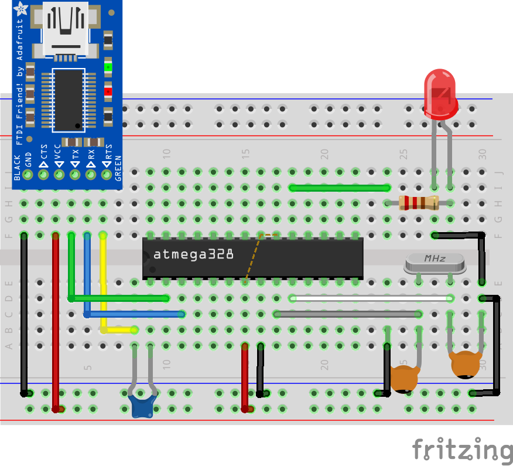

@mainpage Documentation de la bibliothèque UART

@section intro_sec Introduction

Cette bibliothèque fournit des fonctions pour initialiser, envoyer et recevoir des données
via l'interface UART d'un microcontrôleur AVR.

@section install_sec Installation

- Copiez le fichier lib_uart.h et lib_uart.cpp dans le même répertoire que votre programme

@section howto_sec Utilisation

- Incluez lib_uart.h dans votre programme
- Initialisez la communication UART en appelant la fonction initUSART()
- Transmettez des données via transmitByte()
- Recevez des données via receiveByte()

@section example_sec Exemple

Voici un exemple de programme qui utilise la bibliothèque UART pour envoyer un message d'invite
et afficher le code ASCII du caractère reçu sur le PORTB.

@section circuit

 